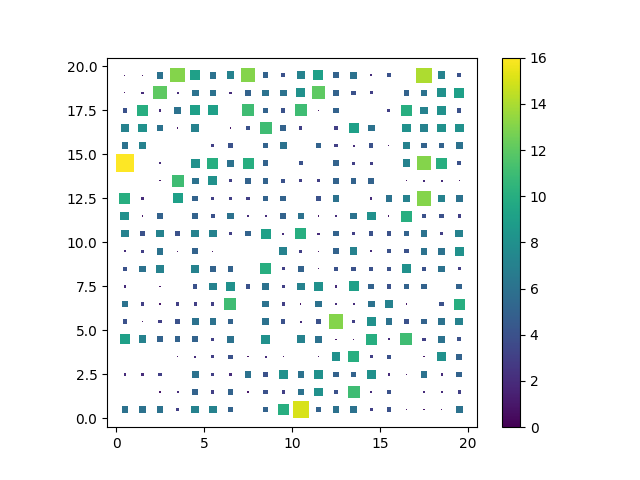
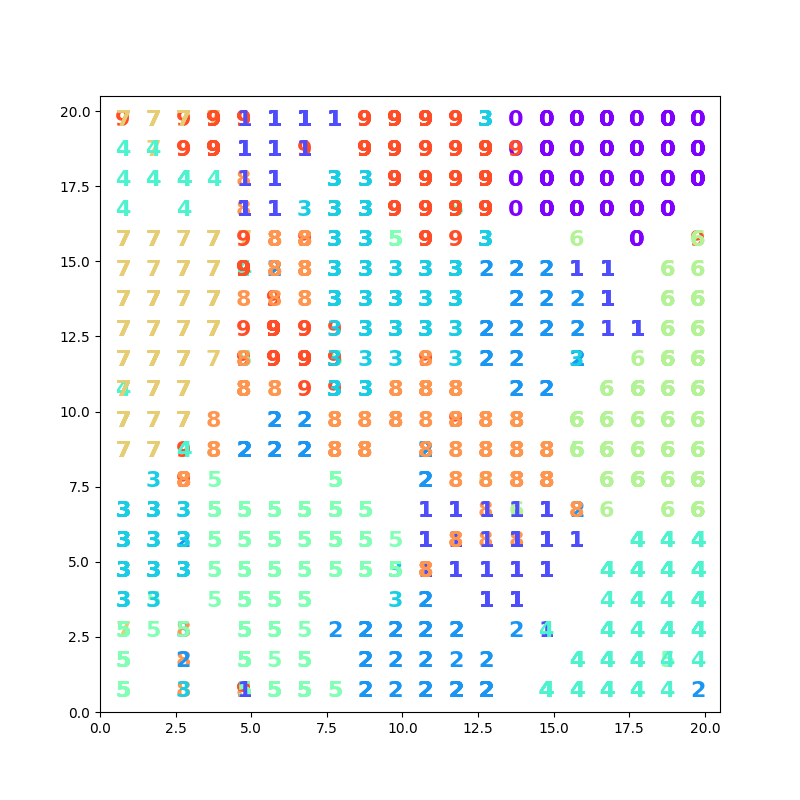

# Self-Organizing Map Project

This repository is a cleaned-up SOM course project with a more standard layout and a script-first entry point.

It includes:

- a Python script version of the notebook workflow,
- the original notebook for interactive exploration,
- MATLAB demos for competitive learning and SOM-style clustering,
- a LaTeX report with the generated figures and tables from the project write-up.

## Layout

```text
.
├── data/
│   └── titanic.csv
├── docs/
│   └── report/
│       ├── Report.tex
│       ├── Report.pdf
│       └── generated figures used by the report
├── outputs/
│   ├── animations/
│   │   ├── SOM.gif
│   │   ├── k-nearest-neighbors.gif
│   │   └── k-nearest-neighbors_1.gif
│   └── figures/
│       └── script-generated plots
├── src/
│   ├── matlab/
│   │   ├── Cluster.m
│   │   └── Competetive.m
│   └── python/
│       └── som_project.py
├── Makefile
├── requirements.txt
├── LICENSE
└── README.md
```

## What The Project Does

The project focuses on self-organizing maps and related neural methods:

- SOM clustering on the handwritten digits dataset,
- SOM-based digit classification using neuron labels from majority voting,
- MATLAB visualizations of competitive learning behavior.

## Demo

The images below are generated outputs from the project:

### Animations


### Figures





## Report Chapters

The report is organized as follows:

- Chapter 2 covers Task 1.
- Chapter 3 covers Task 2.
- Chapter 4 describes the MATLAB prototypes.
- Chapter 5 draws the overall conclusions.

## Installation

Clone the repository:

```bash
git clone https://github.com/malisaber/Self-Organizing-Map.git
cd your-repo
```


## Requirements

- Python 3.8+
- MATLAB R2019b+ for the demo scripts
- A LaTeX distribution if you want to rebuild the report

Install the Python dependencies with:

```bash
pip install -r requirements.txt
```

## How To Run

### Python script

Run the non-interactive script version of the notebook:

```bash
make script
```

or directly:

```bash
python src/python/som_project.py
```


### MATLAB demos

From MATLAB, run:

```matlab
run('src/matlab/Competetive.m')
run('src/matlab/Cluster.m')
```

The demos save their GIFs under `outputs/animations/`.

### Report

Build the LaTeX report with:

```bash
make report
```

The source lives in `docs/report/Report.tex`.

## Notes

- The Python script writes plots into `outputs/figures/`.
- The report assets live in `docs/report/` so the LaTeX source and images stay together.
- `Makefile` includes helper targets for the notebook, script, report, and cleanup tasks.

## License

Released under the MIT License. See [LICENSE](LICENSE).
